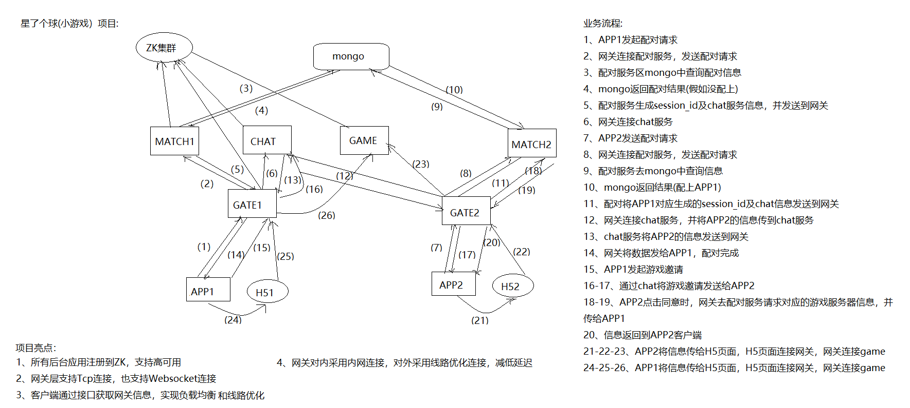

## 游戏  
### 一、职业技能
1. 熟悉python及其开发?  
假设问:那你用什么ide? 干过什么项目？等

2. UML工具类图设计 及 类与类之间的关系 ?  
继承 组合 聚合 关联 依赖等

3. 常用的设计模式?

4. 常用的数据结构?   
map unordered_map vector 涉及底层

5. 常用的加密算法?    
记得看公司代码哦  
RSA DES MD5等

6. linux下系统编程和网络编程
进程 线程 同步互斥等等

7. tcp vs udp

8. websocket vs http

9. epoll使用

10. libevent vs libuv vs asio vs uwebsocket

11. mysql

12. redis

13. nginx

14. zookeeper

15. activemq??? 要不要写

### 二、项目
重点复盘
#### (一) 星了个球  
#### 项目运作流程  
1. 先建立两端的临时会花通路  
2. 再通过这个临时会话通路去邀请对端玩小游戏  
3. 支持好友一起玩游戏,云信管理好友信息,只是不走匹配流程,利用云信机制建立临时会话,走接下来的玩游戏流程    
#### 项目组件  
总体概括为:  
主模块:  
客户端(app h5)  
网关   
临时会话服  
匹配服  
游戏服  
音频混音服  
验证服  
辅助模块:    
接口层  
mongo  
zk集群  
web后台  

#### 客户端  
一. 分类  
2种,一种是app(app是为了建立临时会话流程,内嵌h5作为小游戏端)     
一种是纯h5端   
二. 特点  
app与app app与H5可以互通,也就是app端可以和h5端匹配  

#### 网关  
作为客户端端和后台所有服务的桥梁,由以下特点:    
支持分布式部署  
支持协议转化  
支持负载均衡  
支持线路优化  

#### 临时会话服    
作为双端临时通信桥梁,由以下特点:  
支持分布式部署    
由匹配服分配一个临时session和临时会话服  
可以双端聊天    
可以邀请一起进入游戏    
  
#### 匹配服    
支持分布式部署  
作为双端匹配会话的桥梁,由以下特点:    
为双端分配一个临时session、临时会话服、游戏服     
借助mongo存储匹配过程中的信息  

#### 游戏服        
做为小游戏的主服务器,由以下特点:    
由其他团队开发  
提供小游戏的主玩法  

#### 音频混音服          
支持双端语音,由以下特点:    
借助了成熟的音频解决方案:声网    

#### 验证服          
支持音频的验证,由以下特点:    
支持分布式部署  

#### 项目辅助模块  
一. 接口层  
主要作为所有服务的负载均衡使用  

二. mongo  
提供匹配服匹配过程数据存储    

三. zk集群  
作为整个项目的注册中心使用  

四. web后台  
提供监控、统计数据的一些功能  

#### 项目仍需要主要的点   
一. 整个项目的匹配流程、进入游戏流程图解  
 

#### 项目亮点   
1. 使用zk作为注册中心,支持高可用  
2. 网关使用自实现websocket协议,便于控制,支持多端链接  
3. 客户端通过接口获取网关信息,支持负载均衡
4. 网关物理机具有三网卡,支持线路优化  

#### 项目的一般概括问题  
一. 这个项目认为的最大难点是什么？ 是如何克服的呢？  
1. 当属如何线路优化,降低客户端延迟  
1). 网关物理机采用三网卡,支持三网连接  
2). 客户端根据自己的网络类型调用接口选择合适的网关运营商以降低延迟  

二. 你认为这个项目能够改进的地方是什么  
1. mongo是单实例,如果宕机将会导致匹配服务不可用  
1). 至少mongo有主备切换功能,主宕机备份转主.可以利用zk或者其他机制实现  

#### (二) 魔力宝贝
#### 项目组件
#### dirsvr  
一. dirsvr架构  
   dirsvr充当一个大区的列表服,每个大区下可以配置多个,提供客户端sdk登录 服务器列表控制 角色列表 等一系列功能  

二. dirsvr相关组件  
1. http客户端使用的是libcurl  
2. http服务器端使用的是mongoose  
3. xml解析使用的是tinyxml2  
4. 为啥http客户端和服务器不使用一个呢？？？？？？？

三. dirsvr与SDK的交互逻辑呢？  
1. 客户端先从接口中获取hotfix.json文件(提前在nginx中配置好的),获取到大区的一些配置信息,其中包括dirsvr的地址,一个大区下可能会有多个列表服,这是负载均衡之后的url  
2. 客户端通过获取到的dirsvr的url获取该大区的一些配置信息  
3. 客户端sdk的登录先通过dirsvr验证然后返回结果
4. 接下来选服选角流程

四. dirsvr的负载均衡策略  
1. 大区下的多个dirsvr是信息是配置在nginx里面的(类似一个静态json文件)  
2. 客户端通过一个接口获取到这个大区下的dirsvr地址(nginx负载均衡,返回一个)    
3. 可以优化！！！！！！！！

#### 主服    
一. 说的相关玩法逻辑开发 是哪些逻辑呢？  
多结局副本 全服夺宝 时装 技能 天赋等等  
1. 多结局副本如何实现的?  
1). 多结局副本是分为几个章节,每个章节是一个副本,每个副本里面有多个关卡  
2). 多结局的路线是配置在表中的,如果一个关卡后有多结局,会配置上对应的关卡   
3). 在每个多结局副本结束前或者关卡任务完成后会发起一轮队伍投票,选择下一个关卡或者副本  
4). 发投票端为客户端,因为客户端在关卡结束和副本结束前会有一些UI展示,由客户端绝对发起时机  
5). 副本组织结构  
定义副本基类,并提供一个注册方法,将所有实例化的基类都收集起来  
在副本关键时机(比如进入 切关等)定义为虚函数以供子副本实例重写  
在副本关键时机(比如进入 退出 关卡通关 副本结束等)抛出事件以供子副本模块处理   
注意事项:  
每个副本实例都是一个对象,由副本的父对象进行收集和控制  
副本对象独立存储,每个玩家身上挂载了一个副本指针,用来获取副本相关信息  
1. 全服夺宝如何实现的?  
1). 全服夺宝活动是规定连续多少天之内,每天开启一定轮次,每轮报名抽奖礼品  
2). 图解
 

1. 能不能找几个高大上的玩法？？？？？  

二. 主服的架构  
gateway gamesvr scenesvr 构成一个主服  
1. gateway  
1). 单服可以多个  
2). 网络库用的是libuv  
3). 负载均衡策略  
因为对外的,gateway不会轻易变动,所以是写死在nginx里面,利用nginx做负载均衡  
可以优化！！！！！

2. gamesvr  
1) 单服一个
2) http客户端和服务器用是libcurl  
3) 使用的是共享内存(这还是挺方便的)      
4) 容错机制  
目前没有容错机制,可以优化!!!!!!!!  

5. scenesvr  
1). 单服可以多个,采用分线机制  
2). 负载均衡由gamesvr控制,uid % scene.size()  
3). 采用双写机制     
写redis(作为缓存):1s遍历一次需要存储的列表      
写db:5min遍历一次需要存储的列表  
注意:  
1). 如何切线??  
去公司看相应的代码！！！！！！？？？？？？  
2). 如何双写??  
找资料总结一下！！！！！？？？？？？？  
3). 如何处理redis和db数据不一致?  
去公司看看redis全部改变的那个相关代码！！！！！？？？？？？？？  

#### 辅服     
一. GMT服架构
1. http请求端用的是libcurl, mongoose用的是http服务器  
2. 实现  
举例:http://xxx.xxx.xxx.xxx:80/gmt/xxx/xxx?......  
1). 将第一级的gmt作为controller层的划分,也就是可以有多个controller层  
2). 每个controller层里面注册了很多具体的http要处理的地址,比如/xxx/xxx?......   

二. GMT服具体有哪些功能呢？  
主要是给予运营手动控制游戏的一种手段  
服务器控制 玩家控制 交易控制 公会控制等等

三. 交易服  
1. 架构    
1). 网络库用的是libuv  

2. 审核逻辑    
上架有公示期审核 公示期结束后 由订单审核 如客服不立即审核,会有默认审核等等
审核结果会伴随着对玩家的相应惩罚,比如冻结玩家交易行 冻结道具 冻结金币等等    

3. 交易行大体实现逻辑   
1). 交易行同步逻辑  
同步的具体逻辑又是什么呢?  
交易服和玩家所在的场景服各有一个订单操作同步列表,互相进行同步与删除   
2). 交易行数据存储   
对于交易行数据没有采用其他缓存逻辑,采用的是定时器写db的逻辑,1s间隔,扫描变化的数据然后存到数据库中,应该是交易行数据变化频率不高并且在数据库qps承受范围之内  
那项目这方面qps是多少?  2000以内  
3). 交易行离线玩家数据存储  
交易服不论卖家当前是否在线,都将交易数据存档玩家离线列表中. 同时场景服将玩家状态上报到交易服上,交易服根据玩家所在的场景服id发送交易数据,如果玩家当前在线,能够同步直接处理玩家离线数据,否则等玩家上线同步交易服更新数据    
  

#### 项目仍需要主要的点 
1. 玩家登录流程  
到公司看代码确认一下！！！！！！？？？？？？？？？？         
1). 玩家通过gateway将请求发往gamesvr  
2). gamesvr判断共享内存的数据有无初始化,初始化通过，没有初始化,从db中加载共享内存部分数据,初始化共享内存,下一步
3). gamesvr判断这个玩家有没有在内存中,如果有,走进入游戏流程,如果没有,从db中加载玩家数据,走游戏进入游戏流程(之后常驻内存)    
4). gamesvr通过uid % scene.size()将进入游戏请求发到scene中,scene处理玩家登录,如果玩家在内存中,通过,如果不在内存中,如果从redis中加载玩家数据成功,通过,如果加载不成功,从db中加载数据,走进入游戏流程  
5). 玩家进入scene成功之后,通知gamesvr处理,玩家进入游戏成功  

2. 项目日志使用的是环形队列  
到公司看代码确认一下！！！！！！？？？？？？？？？  

#### 项目的一般概括问题  
一. 这个项目认为的最大难点是什么？ 是如何克服的呢？  
要好好想一下  

二. 你认为这个项目能够改进的地方是什么  
1. dirsvr的负载均衡策略  
1). 是写死在一个接口中的,通过nginx进行负载均衡  
2). 缺点是如果某一个服务宕机,不能及时更新,必然导致接下来客户端拿到的url有的是无效的  
3). 改进  
可以将dirsvr纳入注册中心管理,客户端通过接口从注册中心获取数据,或者由数据中心更新相应的配置文件即可  

2. 单服gamesvr只有一个  
1). gamesvr只要宕机,导致无法对外提供服务  
2). 因为gamsvr数据来源于共享内存和数据库,可以采用主备服务,主gamesvr宕机,备用gamesvr起来,继续对外提供服务  
3). 如何进行主备切换呢?
zookeeper:利用它的主服务建立临时节点,主服务宕机,临时节点删除会通知监听这个路径的备用服务的特点  
利用端口的唯一性:gamesvr循环间隔监听一样的端口,如果主服务宕机,这样备用服务能监听成功   

3. 主服之间同步数据过于繁琐  
没有一个统一的数据层或者数据中心处理数据,同步数据过于繁琐  

## 软件开发  
### 一、职业技能  
和上面一样

### 二、项目  
重点复盘