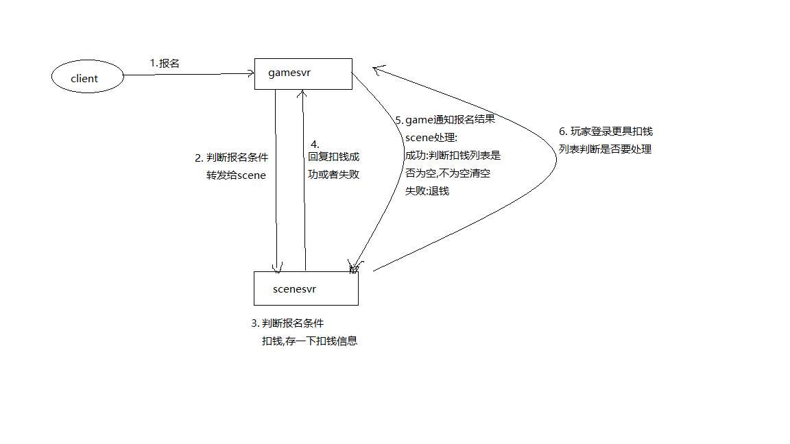

## 游戏  
### 一、职业技能
1. 熟悉python及其开发?  
假设问:那你用什么ide? 干过什么项目？等

2. UML工具类图设计 及 类与类之间的关系 ?  
继承 组合 聚合 关联 依赖等

3. 常用的设计模式?

4. 常用的数据结构?   
map unordered_map vector 涉及底层

5. 常用的加密算法?    
记得看公司代码哦  
RSA DES MD5等

6. linux下系统编程和网络编程
进程 线程 同步互斥等等

7. tcp vs udp

8. websocket vs http

9. epoll使用

10. libevent vs libuv vs asio vs uwebsocket

11. mysql

12. redis

13. nginx

14. zookeeper

15. activemq??? 要不要写

### 二、项目
重点复盘
#### (一) 星了个球

#### (二) 魔力宝贝
#### 项目组件
#### dirsvr  
一. dirsvr架构  
   dirsvr充当一个大区的列表服,每个大区下可以配置多个,提供客户端sdk登录 服务器列表控制 角色列表 等一系列功能  

二. dirsvr相关组件  
1. http客户端使用的是libcurl  
2. http服务器端使用的是mongoose  
3. xml解析使用的是tinyxml2  
4. 为啥http客户端和服务器不使用一个呢？

三. dirsvr与SDK的交互逻辑呢？  
1. 客户端先从接口中获取hotfix.json文件(提前在nginx中配置好的),获取到大区的一些配置信息,其中包括dirsvr的地址,一个大区下可能会有多个列表服,这是负载均衡之后的url  
2. 客户端通过获取到的dirsvr的url获取该大区的一些配置信息  
3. 客户端sdk的登录先通过dirsvr验证然后返回结果
4. 接下来选服选角流程

四. dirsvr的负载均衡策略  
1. 大区下的多个dirsvr是信息是配置在nginx里面的(类似一个静态json文件)  
2. 客户端通过一个接口获取到这个大区下的dirsvr地址(nginx负载均衡,返回一个)    
3. 可以优化！！！！！！！！

#### 主服    
一. 说的相关玩法逻辑开发 是哪些逻辑呢？  
多结局副本 全服夺宝 时装 技能 天赋等等  
1. 多结局副本如何实现的?  
1). 多结局副本是分为几个章节,每个章节是一个副本,每个副本里面有多个关卡  
2). 多结局的路线是配置在表中的,如果一个关卡后有多结局,会配置上对应的关卡   
3). 在每个多结局副本结束前或者关卡任务完成后会发起一轮队伍投票,选择下一个关卡或者副本  
4). 发投票端为客户端,因为客户端在关卡结束和副本结束前会有一些UI展示,由客户端绝对发起时机  
5). 副本组织结构  
定义副本基类,并提供一个注册方法,将所有实例化的基类都收集起来  
在副本关键时机(比如进入 切关等)定义为虚函数以供子副本实例重写  
在副本关键时机(比如进入 退出 关卡通关 副本结束等)抛出事件以供子副本模块处理   
注意事项:  
每个副本实例都是一个对象,由副本的父对象进行收集和控制  
副本对象独立存储,每个玩家身上挂载了一个副本指针,用来获取副本相关信息  
1. 全服夺宝如何实现的?  
1). 全服夺宝活动是规定连续多少天之内,每天开启一定轮次,每轮报名抽奖礼品  
2). 图解
 

1. 能不能找几个高大上的玩法？？？？？  

二. 主服的架构  
gateway gamesvr scenesvr 构成一个主服  
1. gateway  
1). 单服可以多个  
2). 网络库用的是libuv  
3). 负载均衡策略  
因为对外的,gateway不会轻易变动,所以是写死在nginx里面,利用nginx做负载均衡  
可以优化！！！！！

2. gamesvr  
1) 单服一个
2) http客户端和服务器用是libcurl  
3) 使用的是共享内存(这还是挺方便的)      
4) 容错机制  
目前没有容错机制,可以优化!!!!!!!!  

5. scenesvr  
1). 单服可以多个,采用分线机制  
2). 负载均衡由gamesvr控制,uid % scene.size()  
3). 采用双写机制     
写redis(作为缓存)    
写db  
注意:  
1). 如何切线??  
2). 如何双写??  

#### 辅服     
一. GMT服架构
1. http请求端用的是libcurl, mongoose用的是http服务器  
2. 实现  
举例:http://xxx.xxx.xxx.xxx:80/gmt/xxx/xxx?......  
1). 将第一级的gmt作为controller层的划分,也就是可以有多个controller层  
2). 每个controller层里面注册了很多具体的http要处理的地址,比如/xxx/xxx?......   

二. GMT服具体有哪些功能呢？  
主要是给予运营手动控制游戏的一种手段  
服务器控制 玩家控制 交易控制 公会控制等等

三. 交易服  
1. 架构    
1). 网络库用的是libuv  

2. 审核逻辑    
上架有公示期审核 公示期结束后 由订单审核 如客服不立即审核,会有默认审核等等
审核结果会伴随着对玩家的相应惩罚,比如冻结玩家交易行 冻结道具 冻结金币等等    

3. 交易行大体实现逻辑   
1). 交易行同步逻辑  
2). 交易行数据存储   
对于交易行数据没有采用其他缓存逻辑,采用的是定时器写db的逻辑,1s间隔,扫描变化的数据然后存到数据库中,应该是交易行数据变化频率不高并且在数据库qps承受范围之内    
3). 交易行离线玩家数据存储  
交易服不论卖家当前是否在线,都将交易数据存档玩家离线列表中. 同时场景服将玩家状态上报到交易服上,交易服根据玩家所在的场景服id发送交易数据,如果玩家当前在线,能够同步直接处理玩家离线数据,否则等玩家上线同步交易服更新数据    
  

#### 项目仍需要主要的点 
1. 玩家登录流程  
2. 项目日志使用的是环形队列

#### 项目的一般概括问题  
一. 这个项目认为的最大难点是什么？ 是如何克服的呢？

二. 你认为这个项目能够改进的地方是什么

## 软件开发  
### 一、职业技能  
和上面一样

### 二、项目  
重点复盘